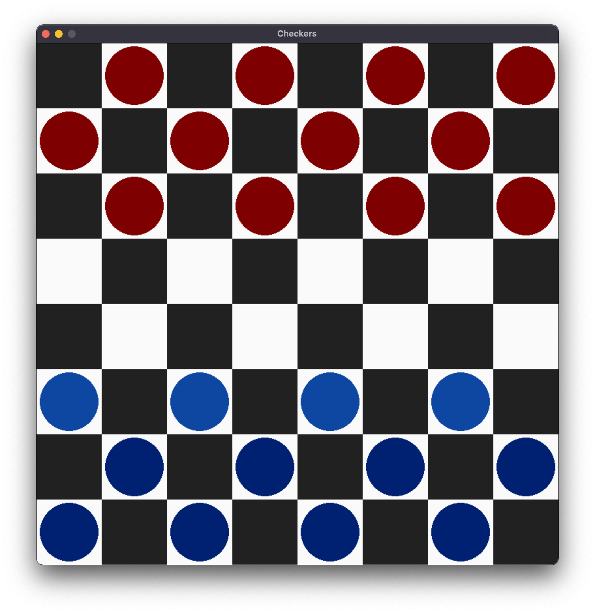

[](https://github.com/adamsvestka/Checkers/actions/workflows/python-app.yml)
[](https://adamsvestka-checkers.readthedocs.io/en/latest/)

**A game of checkers against a computer opponent.**

This project is written in Python, tested with version 3.9.10.
[Pygame](https://www.pygame.org/) is used for cross-platform graphics.
A version of this repository is hosted on [GitHub](https://github.com/adamsvestka/Checkers).




# Installation

1. Grab a version of the source code from [GitHub](https://github.com/adamsvestka/Checkers)

    - You can either visit the link above and click on <kbd>Code ▼</kbd> > <kbd>
    <svg aria-hidden="true" height="10" viewBox="0 0 16 16" version="1.1" width="10"><path fill="currentColor" fill-rule="evenodd" d="M3.5 1.75a.25.25 0 01.25-.25h3a.75.75 0 000 1.5h.5a.75.75 0 000-1.5h2.086a.25.25 0 01.177.073l2.914 2.914a.25.25 0 01.073.177v8.586a.25.25 0 01-.25.25h-.5a.75.75 0 000 1.5h.5A1.75 1.75 0 0014 13.25V4.664c0-.464-.184-.909-.513-1.237L10.573.513A1.75 1.75 0 009.336 0H3.75A1.75 1.75 0 002 1.75v11.5c0 .649.353 1.214.874 1.515a.75.75 0 10.752-1.298.25.25 0 01-.126-.217V1.75zM8.75 3a.75.75 0 000 1.5h.5a.75.75 0 000-1.5h-.5zM6 5.25a.75.75 0 01.75-.75h.5a.75.75 0 010 1.5h-.5A.75.75 0 016 5.25zm2 1.5A.75.75 0 018.75 6h.5a.75.75 0 010 1.5h-.5A.75.75 0 018 6.75zm-1.25.75a.75.75 0 000 1.5h.5a.75.75 0 000-1.5h-.5zM8 9.75A.75.75 0 018.75 9h.5a.75.75 0 010 1.5h-.5A.75.75 0 018 9.75zm-.75.75a1.75 1.75 0 00-1.75 1.75v3c0 .414.336.75.75.75h2.5a.75.75 0 00.75-.75v-3a1.75 1.75 0 00-1.75-1.75h-.5zM7 12.25a.25.25 0 01.25-.25h.5a.25.25 0 01.25.25v2.25H7v-2.25z"></path></svg>
    Download ZIP</kbd> to download the source code
    - Or you can clone the repoitory using a command: `git clone https://github.com/adamsvestka/Checkers.git`

1. Install the dependencies

    This project has 2 dependencies:
    - [Pygame](https://www.pygame.org/) for cross-platform graphics
    - [Scipy](https://www.scipy.org/) for curve-fitting the AI's computation time and adjusting its computation depth
    
    Run the following command to install the dependencies:

    ```bash
    pip install -r requirements.txt
    ```

1. And finally, run the application
    
    ```bash
    python main.py
    ```


# Debugging

The application's behavior can be altered by setting certain enviroment variables.
This is useful for debugging and testing, it is **not intended for the end user**.

Below is a guide on setting enviroment variables on different operating systems.
If you want to view a list of accepted enviroment variables, check out the `Enviroment variables` section.

**macOS, Linux and other Unix-like systems**

```bash
DEBUG=1 MINIMUM_DEPTH=5 python main.py
```

**Windows**

On Windows, you have to clear the environment variables manually afterwards.

```batch
set DEBUG=1
set MINIMUM_DEPTH=5
python main.py
set DEBUG=
set MINIMUM_DEPTH=
```


# Building the docs

This project is annotated using python docstrings. The docstrings are written in a combination of the [NumPy docstring format](https://numpydoc.readthedocs.io/en/latest/format.html) and the [Sphinx docstring format](https://www.sphinx-doc.org/en/master/usage/restructuredtext/basics.html).

Autodoc is used to grab the docstrings from the python source code, Napoleon is used to convert the docstrings to Sphinx format and Sphinx then generates the documentation. MyST plugin is used to incorporate this `README.md` file into the documentation. And RTD theme is used to give the documentation some *extra flair*.

Under the `docs` directory there is a `requirements.txt` file which contains all the dependencies needed to build the documentation. The `conf.py` file contains Sphinx configuration. The `Makefile` contains the build command. And `*.rst` files declare the Sphinx directives used in the documentation.

You can build the documentation yourself by installing the dependencies and making against the `html` target:
```bash
cd docs
pip install -r requirements.txt
make html
```

The [GitHub repository](https://github.com/adamsvestka/Checkers) is integrated with Read the Docs so a push to the `master` branch will trigger an automated build. The result is hosted [here](https://adamsvestka-checkers.readthedocs.io/en/latest/).

```{admonition} Note
If you do not have `make` you can run this command instead: `sphinx-build -M html . build`
```
