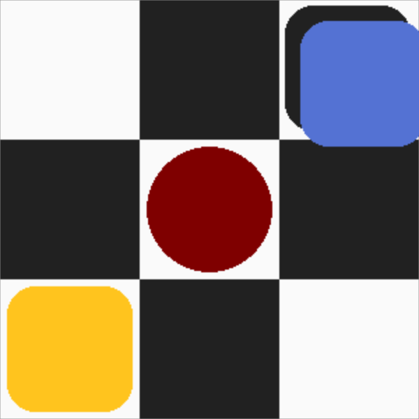

How to play
===========

There are many different variations of Checkers, sometimes also known as Draughts, I settled on the simplest version.
The game is played on a checkered board that is 8 squares by 8 squares large.
There are two players who take turns moving a piece.
One of these players is the human player, as whom you will play, and the other is the computer.

Each player starts with 12 pieces of the same color, the players' colors are randomly chosen at the beginning of the game.
Game piece can only ever occupy white squares.
The human player starts with their pieces occupying 12 squares from the bottom of the board, and the computer starts with 12 pieces distributed from the top of the board.

Moving pieces
-------------

During your turn you select a piece to move, this is done by clicking on the piece, the piece will then appear lifted off the board.
When you select a piece the squares you can move it to will become highlighted.
Pieces can move to empty squares one square diagonally forward, that is, opposite the side where they started.
You cannot move to a square that is already occupied.

    Possible moves a normal piece can perform

    Possible moves a king piece can perform

Capturing moves
---------------

However, if the target square is occupied by an enemy piece and the square behind it is empty, you can jump (or capture) the enemy piece.
If you have a capturing move available, you must make a capturing move.
If you have multiple different capturing moves are available, you can freely choose between them.
After performing a capturing move, if you can capture again with the same piece, you must do so (again, if there are multiple, you can freely choose between them).
You must keep performing capturing moves until you cannot capture any more or you reach the end of the board with a normal piece.

    A possible normal piece capturing move

    A possible king piece capturing move

King piece
----------

If you reach the end of the board with a normal piece, that piece will be promoted to a king.
King pieces function in the same way as normal pieces, except they can move in any direction.
Promoting a piece takes precedence over continuing a capturing spree, therefore if you reach the opposite end of the board with a normal piece, it will be promoted and your turn ends immediately.
This does not apply to kings, if you happen to land on the opposite end of the board with a king, nothing happens, you will continue capturing, if possible.

    A normal piece

    A king piece
